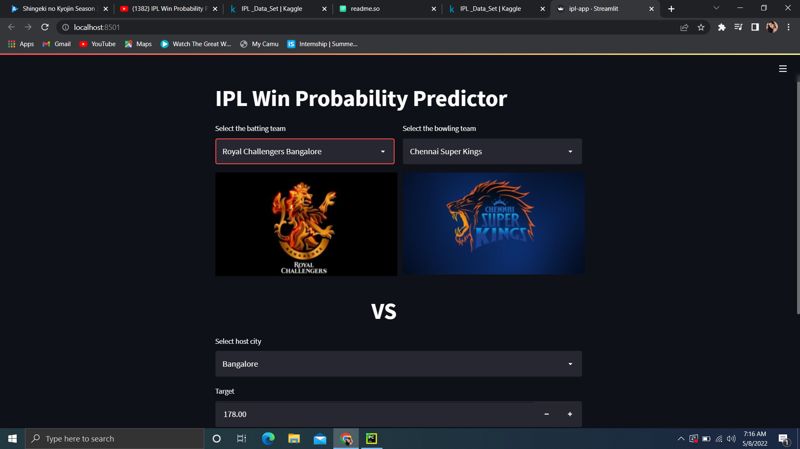

# IPL Win Probaility Predictor

 
predictics the win probability of IPL matches with machine Learning.

Cricket live apps like "ESPNcricinfo","Cricbuzz" shows the win probability of the match using Machine Learning.
This web application uses the same type of analysis to make predictions based on the current flow of match.
## Demo

here is the live demo of the application.

## DataSet

data sets used in this project are imported from Kaggle.

links are mentioned here:
https://www.kaggle.com/datasets/ramjidoolla/ipl-data-set

## preview

## Acknowledgements

 - 
 - 
 - 

## Team

Jyoshna Deepala

 

[Joshna Deepala]
(https://www.linkedin.com/in/jyoshna-deepala-56b7211a7/)
